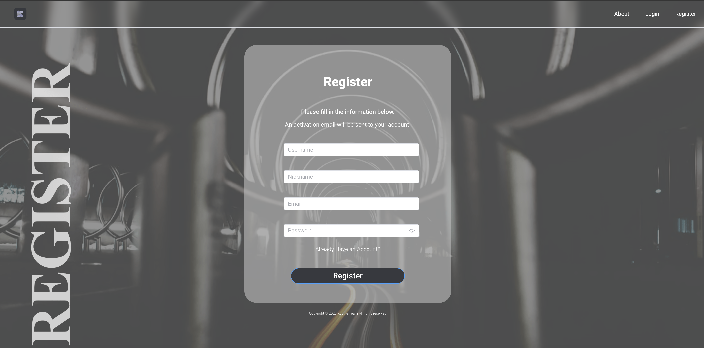

# Game-tracker
## This repository contains the front-end part for Kybyte Game Tracker website as it is developed by this project's other team group members
## The following description will display the demo in images and provide a general idea of the website.

# Tools:
- Vue.js, HTML, CSS, Javascript, axios, ElmentPlus etc
- Using Rest API to fetch and update data

## Table of Contents
- [Home](#section-1)
- [Login/Register](#section-2)
- [Main Page](#section-3)
- [Edit Game](#section-4)
- [Profile](#section-5)
- [Add Game](#section-6)

## Section 1
This game tracker website helps to keep track of your gaming history, including time, personal rating, screenshots, cover images, background image and estimated play times. For which User can record time manually by inserting dates and time or click record time directly. Moreover, user are able to crop images that they have uploaded. 

User are allowed to edit their profiles, including avatar, username, password.

User login and register are included.

## Section 2

## Section 3

## Section 4

## Section 5

## Section 6

